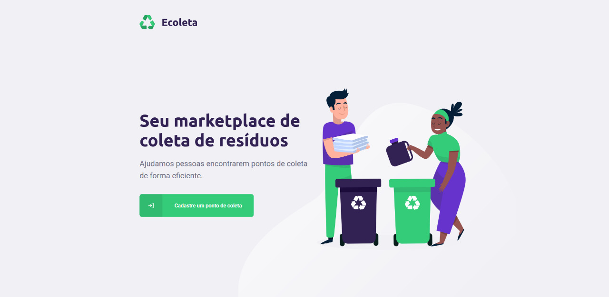
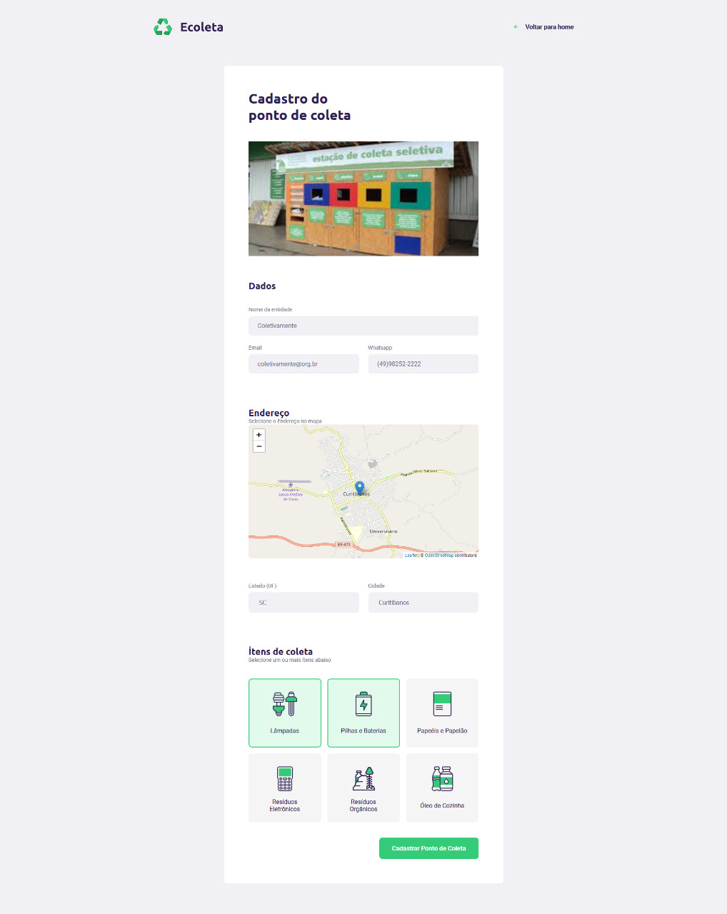
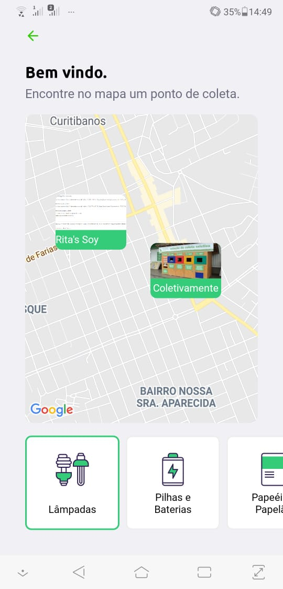
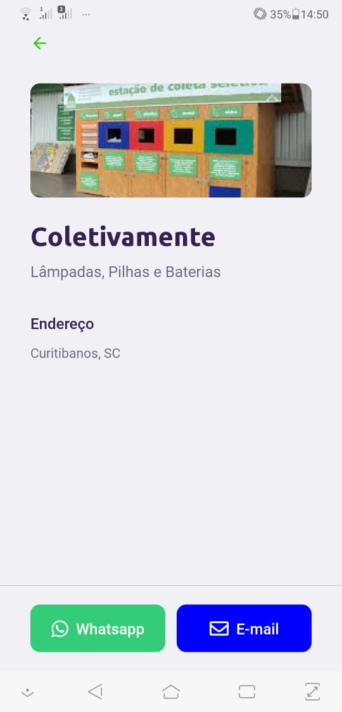

# SemanaDevSuperior2
Sistema de gerenciamento de pontos de coleta apelidado de 'Ecoleta' 

<h2 id="pattern"> 🖼️ Imagens do Projeto </h2>
 
<h2 align="center">Aplicação Web (Admin)</h2>
 

<h4> ⚙️ Funcionalidades </h4>
- Cadastro de pontos de coletas

<h4> 🔨 Tecnologias</h4>

* React

 

 
<h2 align="center">Aplicação Cliente (Mobile)</h2>
 
<h4> ⚙️ Funcionalidades </h4>

- Visualização de pontos de coleta baseados em geolocalização

<h4> 🔨 Tecnologias</h4>

* React-native
* Expo

 
<h1 align="center">
    
    
    
</h1>

<h2 id="backend"> 🧰 Backend</h2>

<h4> 🔨 Tecnologias</h4>

* NodeJS
* Knex 
* SQLite
